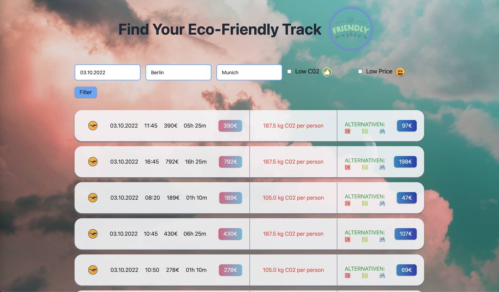
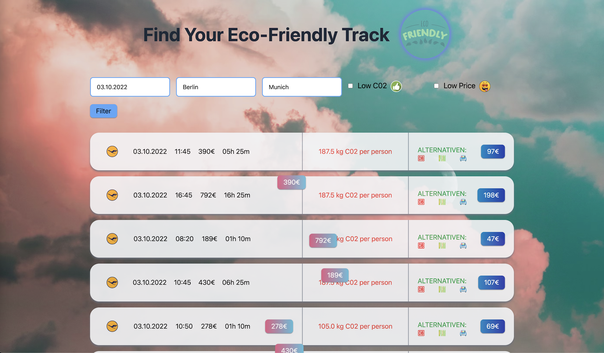

# ecotraks
Slash22 Berlin Project

### Problems It Solves
- Reduces co2 emission by encouraging people to go by train, bla bla car etc
-  Educates people on the impact of their trip on the environment
- Give people the opportunity to immediately book an alternative

### Real World Impact
- Reduction of co2 emission
- Creates awareness about co2 footprint
- Encourages people to make the right choices
- Gives people easy access to alternatives

### Technologies we used
- Python
- HTML
- Tailwind CSS
- APIs
- JavaScript
- SQL

### Future Plans
- add more alternative ways to travel sustainably
- implement a booking system
- implement direct co2 comparison with alternatives
- scaling up to world wide
- improve the filter

